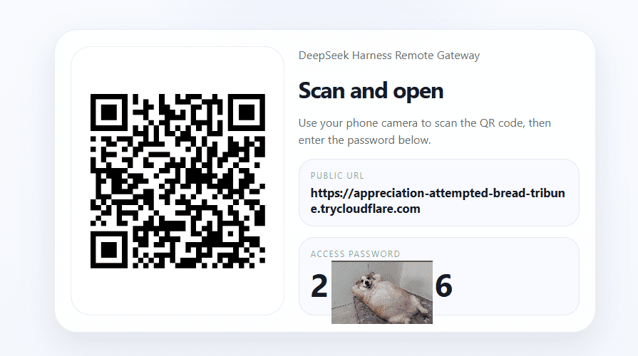
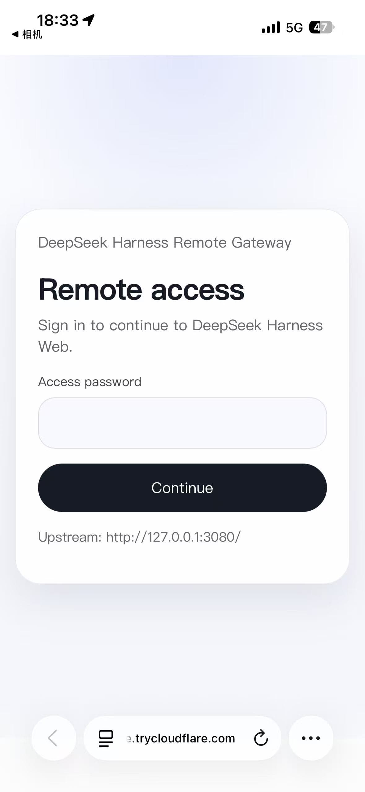
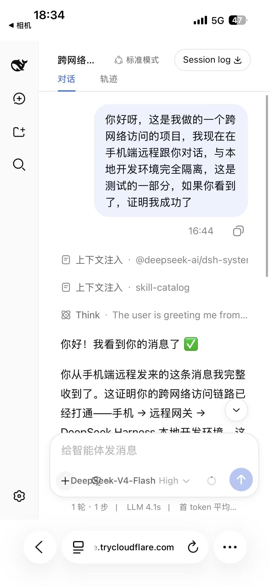

# DSH Remote Gateway

Turn **DeepSeek Harness Web** into a phone-accessible remote workspace without modifying DeepSeek Harness itself.

Lightweight sidecar. Random public URL. Random 6-digit password. QR code on startup.

[Installation](./INSTALL.md) • [FAQ](./FAQ.md) • [Release Checklist](./RELEASE_CHECKLIST.md) • [License](./LICENSE)

## Overview

**中文**

`DSH Remote Gateway` 是一个面向 `DeepSeek Harness Web` 的轻量 sidecar。
它不改动 DeepSeek Harness 本体，只在本地电脑旁边增加一层远程访问能力：

- 启动后自动生成随机公网 URL
- 默认自动生成随机 6 位密码
- 自动输出二维码，手机扫码即可访问
- 手机端只需要浏览器，不需要安装 App
- 适合临时远程访问、移动端查看和继续对话

**English**

`DSH Remote Gateway` is a lightweight sidecar for `DeepSeek Harness Web`.
It does not patch DeepSeek Harness. Instead, it adds a thin remote-access layer beside your local DSH session:

- generates a random public URL on startup
- generates a random 6-digit password by default
- prints a QR code for instant phone access
- works in a browser, no mobile app required
- ideal for temporary remote access and mobile follow-up

## 30-Second Quick Start

1. Start `dsh web` locally and make sure it is reachable at `http://127.0.0.1:3080`.
2. Put `cloudflared` in `remote-gateway/bin/` or make sure it is available in your `PATH`.
3. Run `npm run doctor`.
4. Launch `start_Windows.bat`, `start.ps1`, `start_Mac_or_Linux.sh`, `start.sh`, or `start.command`.
5. Scan the generated QR code on your phone and enter the 6-digit password.

Detailed setup is in `INSTALL.md`.

## Screenshots

Recommended screenshot set for the GitHub homepage:

- desktop share screen showing the QR code, public URL, and 6-digit password
- phone login page
- phone-side DeepSeek Harness conversation view
- optional doctor output in terminal

Suggested asset paths if you want to add images later:

- `docs/screenshots/share-screen.png`
- `docs/screenshots/phone-login.png`
- `docs/screenshots/phone-chat.png`
- `docs/screenshots/doctor-terminal.png`

Example section after assets are ready:

```md



```

## Why This Exists

- DeepSeek Harness already has a strong Web UI.
- For phone access, rebuilding a separate cockpit UI is unnecessary.
- The practical value is remote continuation of work, not a second frontend.
- This gateway keeps the solution lightweight, reusable, and plugin-friendly.

## Highlights

- no DeepSeek Harness source modification
- random public URL by default
- random password by default
- QR-based phone entry
- browser-only mobile access
- Windows, macOS, and Linux support
- optional per-platform release bundles with bundled `cloudflared`

## Default behavior

On normal startup, the gateway now does all of this automatically:

- starts the local HTTP gateway on `127.0.0.1:8787`
- creates a **random 6-digit password** when no password is configured
- starts a **Cloudflare Quick Tunnel** when `cloudflared` is available
- prints the temporary public URL, password, and a terminal QR code
- generates a local share card at `runtime/share.html`
- opens that share card on your desktop by default

This is optimized for the plugin use case: no fixed domain, no public IP, no DSH core changes.

## Platform support

- Windows
- macOS
- Linux

The gateway itself is plain Node.js. The only platform-sensitive dependency is `cloudflared`.

## What it does

- serves a small login page
- issues an `HttpOnly` cookie session
- reverse-proxies the Harness Web UI
- forwards `/api/*`
- forwards the two Harness WebSocket downlinks:
  - `/api/events.mux`
  - `/api/events.host`
- can expose the gateway through a temporary public URL

## What it does not do

- it does **not** change DeepSeek Harness code
- it does **not** provide TLS by itself
- it does **not** require a fixed public domain

## Configuration file

Editable config file:

```text
remote-gateway/config.json
```

If `auth.password` is `null`, the gateway generates a new random 6-digit password on every start.

If you want a fixed password, set it manually in `config.json`.

## Example config

```json
{
  "server": {
    "bindAddress": "127.0.0.1",
    "bindPort": 8787
  },
  "upstream": {
    "origin": "http://127.0.0.1:3080",
    "loopbackMode": null
  },
  "auth": {
    "password": null,
    "sessionSecret": null,
    "cookieName": "dsh_remote_session",
    "sessionTtlHours": 168,
    "secureCookies": false
  },
  "dsh": {
    "command": null
  },
  "tunnel": {
    "enabled": true,
    "mode": "quick",
    "cloudflaredPath": null
  },
  "share": {
    "openOnStart": true
  }
}
```

## Important notes

### Quick Tunnel mode

The default tunnel mode is `quick`, which gives you a random `*.trycloudflare.com` URL.

When `upstream.loopbackMode` is left as `null`, the gateway automatically enables loopback-style upstream headers for Quick Tunnel mode. This avoids having to restart `dsh web` every time the random hostname changes.

This is convenient for temporary sharing and plugin-style usage, but it is not your final fixed-domain deployment shape.

### cloudflared binary

By default, the gateway looks for:

- Windows: `remote-gateway/bin/cloudflared.exe`
- macOS/Linux: `remote-gateway/bin/cloudflared`

If the bundled file is missing, the gateway falls back to `cloudflared` from your system `PATH`.

You can also override it explicitly in `config.json` or via env.

### macOS/Linux notes

- If you place the binary in `remote-gateway/bin/`, make sure it is executable:

```bash
chmod +x remote-gateway/bin/cloudflared
```

- If your desktop environment does not provide `xdg-open`, the gateway still starts normally. It will just print the share page path and you can open it manually.

## Environment overrides

All major settings can still be overridden by environment variables:

- `REMOTE_GATEWAY_BIND_ADDRESS`
- `REMOTE_GATEWAY_BIND_PORT`
- `REMOTE_GATEWAY_UPSTREAM_ORIGIN`
- `REMOTE_GATEWAY_UPSTREAM_LOOPBACK_MODE`
- `REMOTE_GATEWAY_PASSWORD`
- `REMOTE_GATEWAY_SESSION_SECRET`
- `REMOTE_GATEWAY_COOKIE_NAME`
- `REMOTE_GATEWAY_SESSION_TTL_HOURS`
- `REMOTE_GATEWAY_SECURE_COOKIES`
- `REMOTE_GATEWAY_DSH_COMMAND`
- `REMOTE_GATEWAY_TUNNEL_ENABLED`
- `REMOTE_GATEWAY_TUNNEL_MODE`
- `REMOTE_GATEWAY_CLOUDFLARED_PATH`
- `REMOTE_GATEWAY_SHARE_OPEN_ON_START`

## Run

```bash
node src/index.js
```

If `share.openOnStart` is true, a local share card opens automatically. Otherwise, use:

```text
remote-gateway/runtime/share.html
```

## One-click startup

Use the launcher that matches your platform:

- Windows Explorer / CMD: `remote-gateway/start_Windows.bat`
- Windows compatibility alias: `remote-gateway/start.bat`
- Windows PowerShell: `remote-gateway/start.ps1`
- macOS/Linux Terminal: `remote-gateway/start_Mac_or_Linux.sh`
- macOS/Linux compatibility alias: `remote-gateway/start.sh`
- macOS Finder double-click: `remote-gateway/start.command`

The launcher does three things for you:

- checks that Node.js 22+ is available
- auto-runs `npm install` on first launch if dependencies are missing
- starts the gateway with the current `config.json`

For macOS/Linux, make the shell launchers executable once:

```bash
chmod +x remote-gateway/start.sh remote-gateway/start.command
```

## Doctor

Before first launch, you can run a quick environment check:

```bash
npm run doctor
```

It validates:

- Node.js version
- `config.json` parseability
- upstream reachability
- `cloudflared` discovery
- dependency presence
- whether password mode is fixed or random

## Release-friendly layout

- runtime files are now ignored by `remote-gateway/.gitignore`
- log files are ignored by `remote-gateway/.gitignore`
- `remote-gateway/bin/README.md` explains how to bundle or replace `cloudflared`
- `remote-gateway/INSTALL.md` gives first-run setup steps
- `remote-gateway/FAQ.md` answers common deployment questions
- `remote-gateway/RELEASE_CHECKLIST.md` provides a publish sanity check

## Publish package

If you plan to publish this under `topics/dsh-plugin`, the minimum recommended flow is:

1. Keep `README.md`, `INSTALL.md`, and `FAQ.md` together.
2. Keep launcher filenames stable across releases.
3. Run `npm run doctor` before packaging.
4. Decide whether `cloudflared` is bundled in `bin/` or documented as an external dependency.
5. For platform bundles, run `npm run release:bundle -- <target>`.

### Release bundle targets

- `windows-x64`
- `macos-arm64`
- `macos-amd64`
- `linux-amd64`
- `linux-arm64`

### Release bundle commands

```bash
npm run release:bundle -- windows-x64
npm run release:bundle -- --all --allow-missing
```

Generated bundles are written to:

```text
remote-gateway/dist/
```

## Repo Structure

- `src/` gateway runtime
- `scripts/` bootstrap and doctor helpers
- `bin/` optional bundled `cloudflared`
- `vendor/cloudflared/` source binaries for platform release bundles
- `runtime/` generated share page and runtime artifacts
- `INSTALL.md` first-run setup
- `FAQ.md` common usage questions
- `RELEASE_CHECKLIST.md` publish sanity checklist

## Health endpoint

```text
GET /_gateway/health
```

This returns gateway state, upstream probe status, the current public URL, and the active password.
